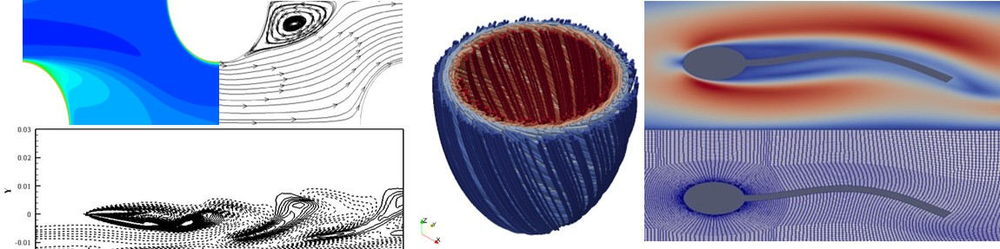

<table border="0">
 <tr>
    <td>I am a joint PhD student at the University of Queensland and Indian Institute of Technology Delhi.  
My PhD research is on simulations to understand ventricular mechanics of heart failure.  
My research interest spreads over computational fluid dynamics, fluid-structure interaction, lattice Boltzman method, heat transfer, FVM, FEM and cardiac mechanics.</td>
    <td> {:height="30%" width="30%"}. </td>
 </tr>
</table>

I am a joint PhD student at the University of Queensland and Indian Institute of Technology Delhi.  
My PhD research is on simulations to understand ventricular mechanics of heart failure.  
My research interest spreads over computational fluid dynamics, fluid-structure interaction, lattice Boltzman method, heat transfer, FVM, FEM and cardiac mechanics.
